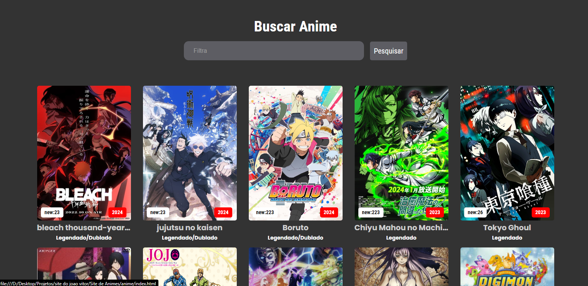

# Omega Animes 🎌

Bem-vindo ao **Omega Animes**, o lugar perfeito para encontrar seus animes favoritos! 🚀

Este projeto foi feito com muito carinho por um amante de animes, mangás e jogos. Aqui você pode buscar animes, ver suas sinopses, gêneros e até conferir os episódios disponíveis.

## Como funciona? 🤔

### 1. Busca 🔍
Logo ao abrir a página, você verá uma barra de busca. É só digitar o nome do anime que você está procurando e apertar o botão "Pesquisar" ou dar Enter. Se o anime estiver na lista, ele vai aparecer na tela. Se não estiver... bem, você verá uma mensagem simpática dizendo que não encontramos o anime 😅.

### 2. Exibição dos Animes 📺
Os animes são exibidos com:
- Uma **imagem de capa** bem estilosa.
- O **nome do anime** em destaque.
- O **ano de lançamento** e a tag **"new"** com a quantidade de episódios disponíveis.

#### Exemplo:


> Aqui temos um exemplo de como os animes aparecem listados. Cada um vem com a sua imagem de capa, nome e outras informações importantes.

Quando você clica em um anime, uma tela com todos os detalhes sobre ele aparece, incluindo sinopse, gêneros, e episódios recentes.

### 3. Visualizando os Detalhes do Anime 🎥
Na página de detalhes, você pode ver informações como:
- **Nome do Anime**
- **Sinopse** do anime
- **Gêneros**
- **Dublagem e data de lançamento**
- Uma lista de episódios disponíveis.

#### Exemplo:


> Ao clicar em um anime, ele abre esta tela de detalhes com a imagem de fundo, sinopse, gêneros e mais!

### 4. Voltar para a Lista ↩️
Se você quiser voltar à lista de animes, é só clicar no **X** no canto superior da tela de detalhes. A página será recarregada e você voltará à lista principal.

---

## Explicação Detalhada do Código 🛠️

### Estrutura do HTML

O arquivo `index.html` contém a estrutura básica da aplicação:
- Um **header** com um título e barra de busca.
- Um **main** onde os animes são carregados dinamicamente.
- Um **footer** com informações de direitos reservados.

#### Campos Importantes:
- O `input` com o ID `filter` é onde o usuário pode digitar o nome do anime que está buscando.
- O **botão** de busca é usado para ativar a função de busca quando clicado.

### O JavaScript: Como a Mágica Acontece ✨

#### Função `mostrarAnimes()`
Essa função é responsável por percorrer a lista de animes e gerar o HTML que será exibido dentro do elemento `<main>`:
```javascript
function mostrarAnimes() {
    let resultado = ""; // Guardar o HTML que vai ser mostrado
    for (let anime of lista_animes) {
        resultado += `
         <div class="anime">
            <section class="imagen" data-sinopse="${anime.sinopse}">
                
                <span class="lancamento">${anime.lancamento}</span>
                <span class="new_capitulo">new: ${anime.episodios}</span>
            </section>
            <h1 title="${anime.nome}">${anime.nome}</h1>
            <p class='dublagem'>${anime.dublagem}</p>
            <p class='sinopse' style="display: none;">${anime.sinopse}</p>
            <p class='genero' style="display: none;">${anime.generos}</p>
        </div>
        `;
    }
    container_animes.innerHTML = resultado; // Coloca o HTML na tela
    adicionarEventos(); // Chama a função para clicar nos animes
}
``````

## Detalhes:

- A função percorre cada item da lista `lista_animes` (que deve ser um array de objetos contendo informações dos animes).
- Para cada anime, é gerado um bloco HTML contendo a imagem, nome, sinopse e outras informações.
- Por fim, o HTML é inserido no elemento `container_animes` na página.

---

## Função `buscarAnime()`
Essa função é ativada quando o usuário digita algo no campo de busca ou clica no botão "Pesquisar". Ela filtra os animes de acordo com o texto digitado:

```javascript
function buscarAnime() {
    let termoBusca = inputBusca.value.toLowerCase(); // Pega o texto que o usuário digitou
    let animes = document.querySelectorAll('.anime'); // Pega todos os animes que estão na tela

    for(let anime of animes) {
        let nomeAnime = anime.querySelector('h1').textContent.toLowerCase(); // Nome do anime em letras minúsculas
        anime.style.display = nomeAnime.includes(termoBusca) ? 'block' : 'none'; // Mostra ou esconde o anime
    }

    // Verifica se tem algum anime visível
    let animesVisiveis = document.querySelectorAll('.anime:not([style="display: none;"])');
    if (animesVisiveis.length === 0) {
        container_animes.innerHTML = `<div class="aviso"><h1>!Anime não encontrados</h1></div>`;
    }
}
````
### Detalhes

- Essa função captura o valor digitado pelo usuário e compara com o nome dos animes na lista. 
- Ela mostra apenas os animes que contêm o termo digitado e oculta os demais. 
- Se nenhum anime for encontrado, exibe uma mensagem de "Anime não encontrado".


## Função `adicionarEventos()`
Aqui, é onde os eventos de clique são adicionados a cada anime. Quando clicado, o anime exibe mais detalhes:

````javascript
function adicionarEventos() {
    let animes = document.querySelectorAll('.anime'); // Pega todos os animes que estão na tela

    for(let anime of animes) {
        anime.onclick = function() {
            // Código que exibe os detalhes do anime clicado...
        };
    }
}
````
### Detalhes:

- Cada anime na lista recebe um evento de clique que, ao ser acionado, mostra uma nova tela com as informações detalhadas do anime.


## Tecnologias usadas 💻
- HTML5 para a estrutura da página.
- CSS3 para deixar tudo bonito e estiloso.
- JavaScript para fazer a magia acontecer e os animes aparecerem dinamicamente.
Font Awesome para os ícones bonitões.


## Feito com 💙 por João Vitor Alves Fialho, um apaixonado por animes e tecnologia!


